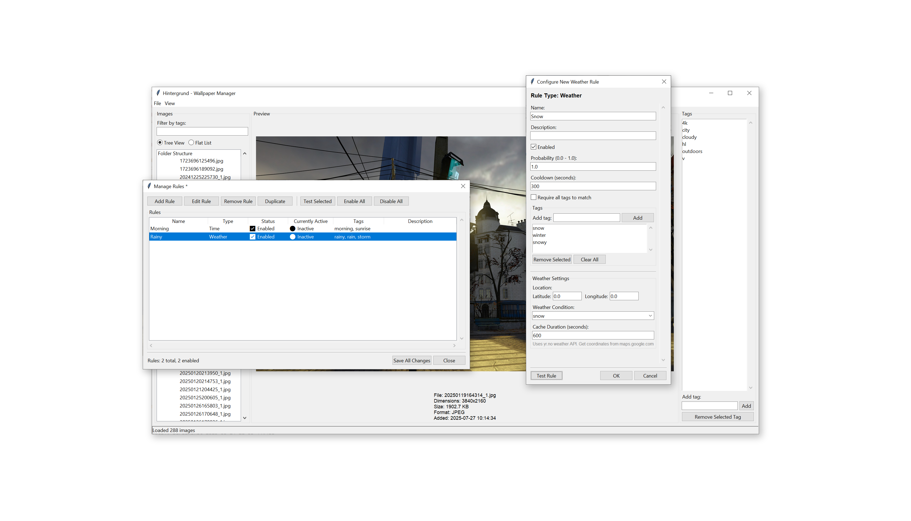

# Hintergrund - Wallpaper tool

A Python application for scanning directories of wallpaper images and storing them in a database with automatic tagging based on folder structure.

## Features

- Recursively scans directories for wallpaper images
- Automatically tags images based on their folder path
- Stores image metadata (dimensions, file size, format) in SQLite database
- **Weather-based wallpaper rules**: Automatically select wallpapers based on current weather conditions
- Time-based and date-based wallpaper rules
- Flexible rule system for custom wallpaper selection logic

## Installation

### Option 1: Download Executable

Download the latest executable for your platform from the [Releases page](../../releases).

- **Windows**: Download `hintergrund.exe`
- **Linux**: Download `hintergrund` (Linux)
- **macOS**: Download `hintergrund` (macOS)

No Python installation required!

### Option 2: Run from Source

1. Make sure you have Python 3.7+ installed
2. Install dependencies:
   ```bash
   pip install -r requirements.txt
   ```

## Usage

### Scanning a Directory

**Using the executable:**
```bash
# Windows
hintergrund.exe scan "C:\path\to\wallpapers"

# Linux/macOS
./hintergrund scan "/path/to/wallpapers"
```

**Using Python:**
```bash
python main.py scan "/path/to/wallpapers"
```

This will:
- Recursively scan the specified directory
- Extract metadata from each image
- Tag images based on their folder structure
- Store everything in a SQLite database

### Tagging System

Images are automatically tagged based on their folder structure. For example:

- Image at `/wallpapers/nature/forest/mountain/sunset.jpg`
- Gets tags: `nature`, `forest`, `mountain`

The base scan directory is not included in tags.

### Listing Images

**Using the executable:**
**Using the executable:**
```bash
./hintergrund list --tags nature forest
python main.py list --tags nature forest
```

## Weather-Based Wallpaper Rules

Hintergrund now supports weather-based wallpaper selection! You can automatically change wallpapers based on current weather conditions using data from yr.no.

### Supported Weather Conditions

- **clear** - Sunny/clear skies
- **cloudy** - Cloudy/overcast
- **rain** - Any type of rain
- **snow** - Snowy conditions
- **thunderstorm** - Thunderstorms
- **fog** - Foggy weather
- **sleet** - Sleet/freezing rain

## (made up) FAQ

- The GUI is ugly, did you know that? - Yes.
- Python is garbage, you know Rust is way better? - Yes.
- This code is bad, did an LLM write it? - Yes.
- This code is genius, did you write it? - Yes.